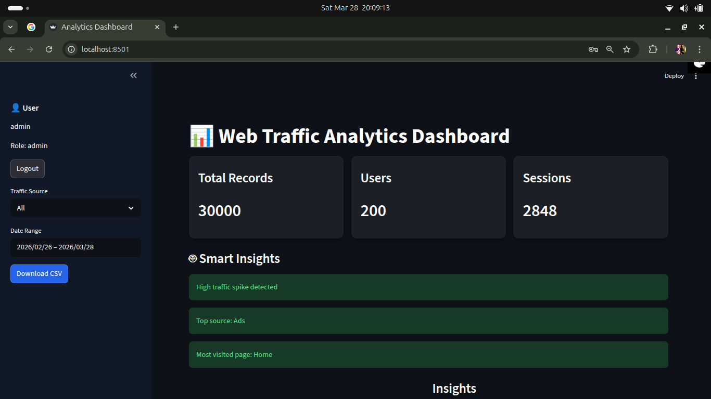
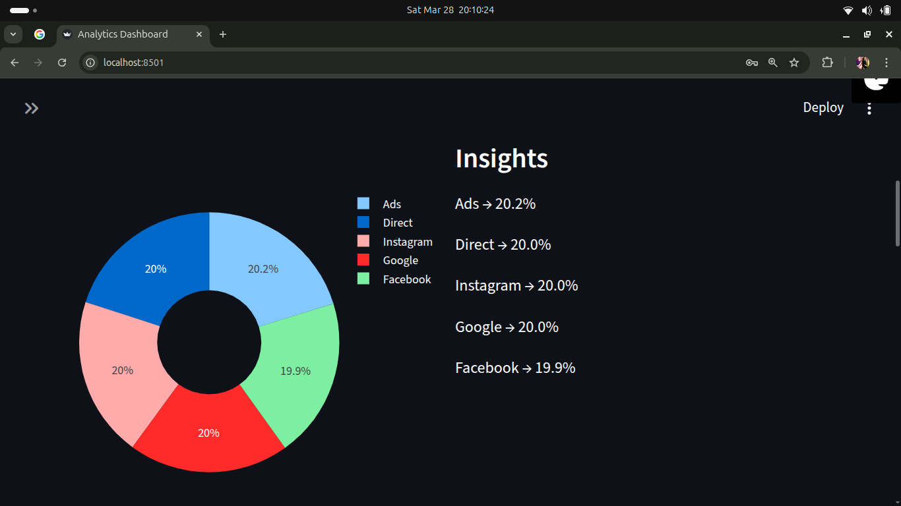
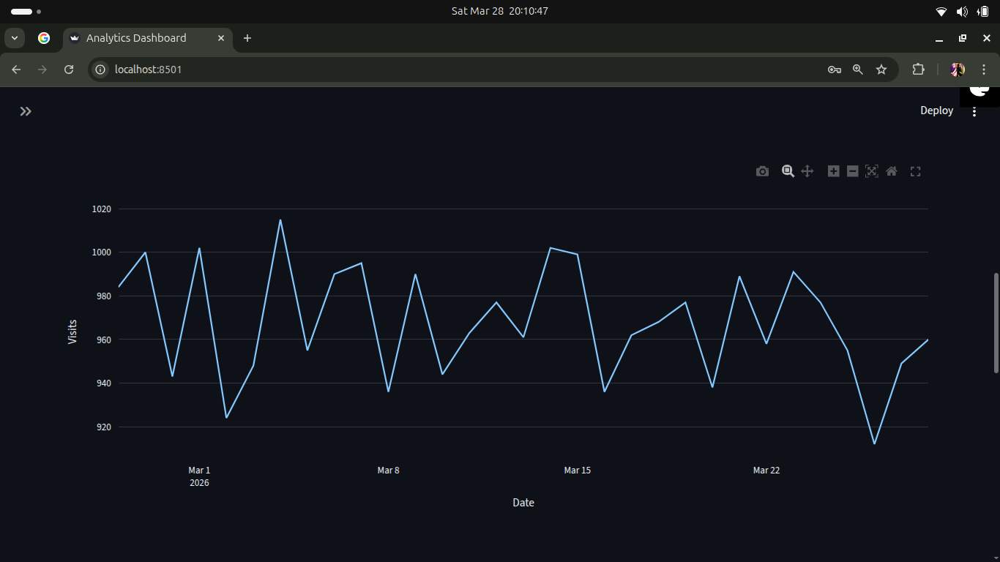
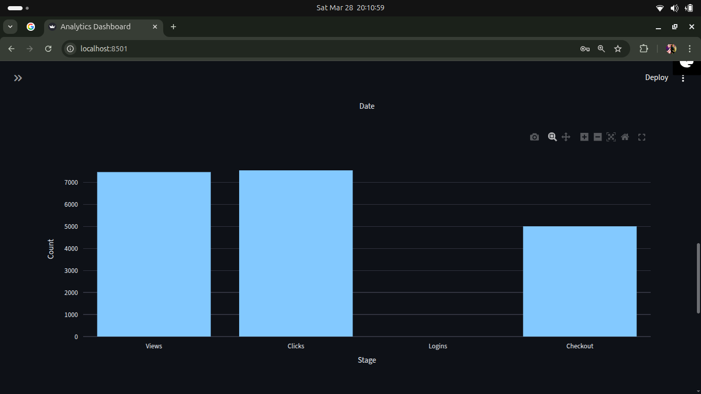
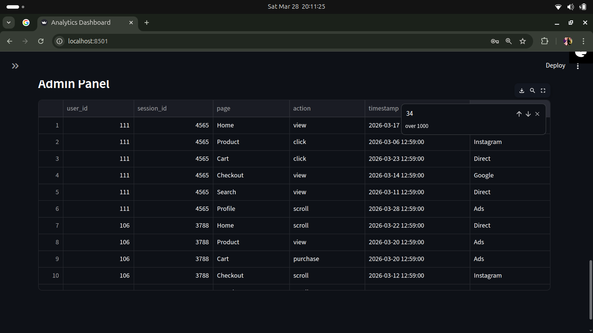
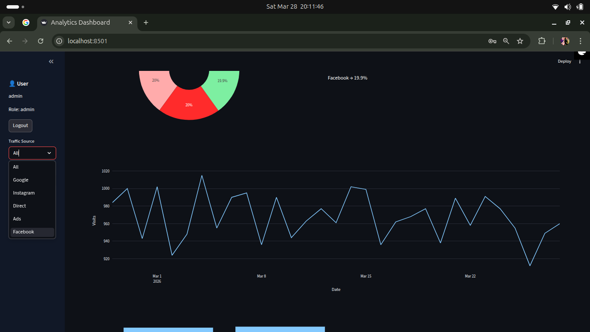

# 📊 Web Traffic Analytics & Data Pipeline (30K+ Records)

## 👩‍💻 Author

**Aishwarya Priydarshni**
🎓 B.Tech (CSE - Data Science)
💡 Aspiring Data Analyst / ML Engineer

---

# 🚀 Overview

This project builds a **complete end-to-end web traffic analytics system** that simulates real-world user interaction data and transforms it into actionable insights.

It demonstrates how raw event-level data can be:

* Generated
* Validated
* Stored
* Processed using SQL
* Visualized through an interactive dashboard

📦 Dataset size: **30,000+ records**
Includes: user sessions, page visits, actions, timestamps, and traffic sources.

---

# ❗ Problem Statement

In real-world systems, lack of proper traffic monitoring can:

* ❌ Hide user behavior patterns
* ❌ Reduce visibility into performance metrics
* ❌ Lead to poor business decisions

---

# ✅ Solution

This project solves these challenges by building a **complete analytics pipeline** that:

* Tracks user activity across sessions
* Analyzes traffic sources and behavior
* Identifies drop-offs in conversion funnels
* Measures user retention and churn
* Generates automated insights

---

# 🔥 Key Features

* ⚙️ End-to-end pipeline (data → database → analysis → dashboard)
* 🔐 Role-based login system (Admin / User)
* 📊 Interactive dashboard using Streamlit
* 🎯 Traffic source & date filtering
* 📥 CSV export functionality
* 🔄 Conversion funnel analysis
* 👥 Cohort analysis & retention tracking
* 🚨 Churn detection (inactive users)
* 📈 DAU / MAU metrics
* 💰 Customer Lifetime Value (LTV)
* 🤖 Automated smart insights

---

# 📊 Dashboard Preview

## 🔹 Dashboard Overview



## 🔹 Traffic Distribution



## 🔹 Daily Traffic Trend



## 🔹 Conversion Funnel



## 🔹 Admin Panel



## 🔹 Filters (Interactive View)



---

# 🧠 Key Insights Generated

* 📈 High traffic spikes detection
* 🎯 Top-performing traffic sources
* 🏆 Most visited pages
* 🔻 Funnel drop-off identification
* 🔁 User retention trends
* ⚠️ Churned users detection

---

# 🛠️ Tech Stack

* 🐍 Python
* 🗄️ SQLite
* 🐼 Pandas
* 🌐 Streamlit
* 📊 Plotly

---

# 📂 Project Structure

```
web-traffic-analytics/
│
├── data/
│   ├── users.csv
│   ├── users.db
│   ├── web_traffic.csv
│   ├── web_traffic.db
│
├── screenshots/
│   ├── dashboard_overview.png
│   ├── traffic_distribution.png
│   ├── daily_trend.png
│   ├── conversion_funnel.png
│   ├── admin_panel.png
│   ├── filters_view.png
│
├── sql/
│   ├── analysis.sql
│   ├── cleaning.sql
│   ├── create_auth_table.sql
│   ├── create_table.sql
│   ├── create_users_table.sql
│
├── app.py
├── auth.py
├── dashboard.py
├── data_validation.py
├── generate_data.py
├── monitor.py
├── run_pipeline.sh
├── requirements.txt
└── README.md
```

---

# ⚙️ How to Run

## 1️⃣ Clone Repository

```
git clone https://github.com/Aishwaryap015/web-traffic-analytics.git
cd web-traffic-analytics
```

## 2️⃣ Install Dependencies

```
pip install -r requirements.txt
```

## 3️⃣ Run Dashboard

```
streamlit run dashboard.py
```

---

# 🔐 Login Credentials

### 👨‍💼 Admin

* Username: `admin`
* Password: `admin123`

### 👤 User

* Username: `user1`
* Password: `1234`

---

# 🔄 Data Pipeline Flow

1. Generate synthetic user data
2. Store data in SQLite database
3. Perform SQL-based analysis
4. Validate and monitor data quality
5. Visualize insights using dashboard

---

# 🎯 Interview Explanation

> “I built an end-to-end web analytics system that simulates production-level traffic data, processes it using SQL pipelines, and generates actionable insights like user retention, churn, and conversion funnels through an interactive dashboard.”

---

# 📌 What This Project Demonstrates

* ✅ Data pipeline development
* ✅ Advanced SQL analytics
* ✅ Dashboard creation
* ✅ Business metrics understanding
* ✅ Real-world problem solving

---

# 🎯 Relevant For

* Data Analyst roles
* Data Science roles
* Machine Learning roles

---

# 📜 License

This project is for educational purposes.

---

# ⭐ Support

If you found this project useful, consider giving it a ⭐ on GitHub!
